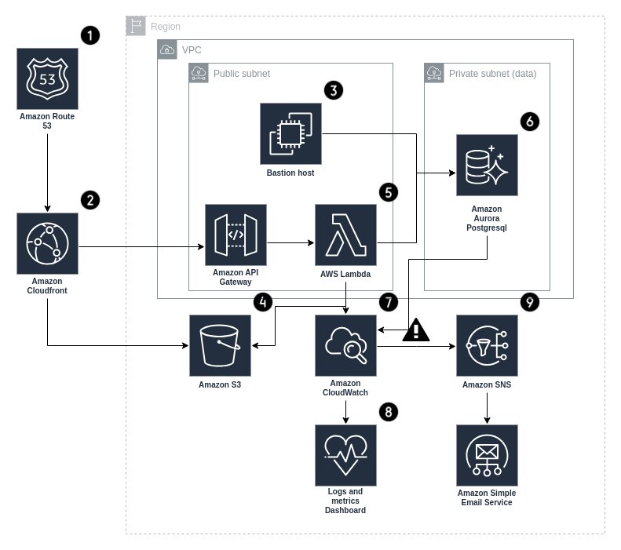

## Course work

1. Infrasructure. According to the scheme, spin up the infrastructure using terragrunt.

Architecture components

The reference architecture illustrates a complete Django serverless deployment.

 - It starts with edge caching in Amazon CloudFront (2) to cache content close to end users for fasterdelivery.  
 - CloudFront pulls static content from an S3 bucket (4) and dynamic content from an API gateway which generates requests to a Django application deployed as a lambda function (5).  
 - Amazon Aurora postgresql (6) hosts the Django database.  
 - Bastion host (3) is used for tunnel to the database.  
 - Infrastructure and application logs and metrics are collected in CloudWatch with a convenient dashboard (8).  
 - Alerts have been configured to send critical notifications to email via Amazon SES (9)

2. Automation. Prepare Ansible roles for build and deploy application.

You need to fork this repo, work with your copy and then create PR to this repo so we can see your commits.
